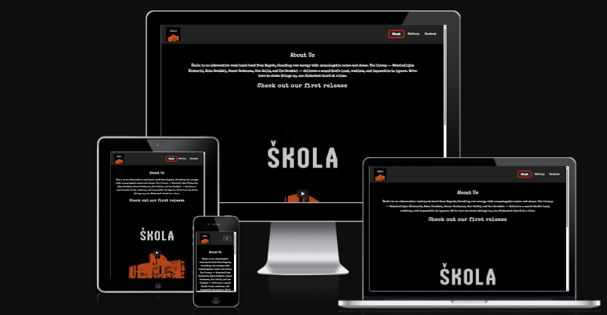
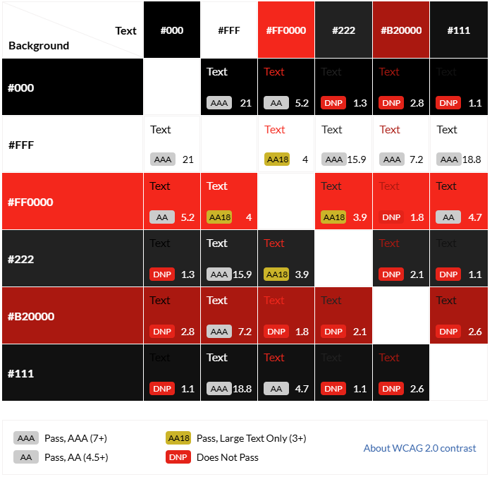

# Škola Bend Website

## Table of Contents
- [Site Overview](#1-site-overview)
- [Planning Stage](#2-planning-stage)
  - [Target Audiences](#target-audiences)
  - [User Stories](#user-stories)
- [Site Aims](#3-site-aims)
  - [Main Objective](#main-objective)
  - [Supporting Objectives](#supporting-objectives)
  - [How This Will Be Achieved](#how-this-will-be-achieved)
- [Wireframes](#4-wireframes)
- [Color Scheme](#5-color-scheme)
- [Technologies Used](#6-technologies-used)
- [Current Features (Common to All Pages)](#7-current-features-common-to-all-pages)
  - [Header Element](#header-element)
  - [Navigation Bar](#navigation-bar)
  - [Anchor Tags (Within All Pages Main Content)](#anchor-tags-within-all-pages-main-content)
  - [Footer](#footer)
  - [Typography](#typography)
- [Individual Page Content Features](#8-individual-page-content-features)
  - [About Page Content](#about-page-content)
  - [Gallery Page Content](#gallery-page-content)
  - [Contact Page Content](#contact-page-content)
  - [Form Feedback Page Content](#form-feedback-page-content)
- [Future Enhancements](#9-future-enhancements)
- [Testing Phase](#10-testing-phase)
- [Additional Notes](#11-additional-notes)
- [Deployment](#12-deployment)
- [Credits](#13-credits)
  - [Honorable Mentions](#honorable-mentions)
  - [General Reference](#general-reference)
  - [Content](#content)
  - [Media](#media)
- [License](#14-license)

## 1. Site Overview

This is the official website for **Škola Bend**, an energetic alternative rock/punk band hailing from Zagreb, Croatia. The site offers fans and event organizers an easy way to explore the band's story, enjoy a gallery of live performances, and get in touch through a simple contact form. Designed with a modern, accessible, and fully responsive layout, the website ensures a seamless experience on any device.



The inspiration for this project came from a close friend who is part of Škola Bend, alongside family and friends—people I know well and have watched grow together through music. For the past three years, they've been passionately playing and honing their sound. Over the last year, they've taken the stage at local pubs, bars, and small festivals, even opening for well-known acts. Earlier this year, they released their debut single, **"Ova Pjesma"** ("This Song"), marking an exciting milestone in their journey.

As their presence in the Croatian music scene quickly grows, they needed an official online hub where fans, friends, and event organizers could easily find reliable information. Since they're still emerging artists, the site focuses on essential content rather than extensive features like merchandise or tour dates. The goal was to create a bold, edgy punk vibe that resonates with their audience, informs newcomers about their music, and provides a direct point of contact for booking future gigs and events.

---

## 2. Planning Stage

### Target Audiences

- **Band Members (Owners):** Need a professional online presence showcasing their story, lineup, and achievements with easy booking/contact options  
- **Visitors:** Want to quickly learn about Škola Bend's music style to decide if they want to explore further  
- **Fans:** Seek background information about band members and want to feel connected to their story  
- **Event Organizers:** Need to understand the band's style and background to evaluate if they fit an event  
- **Developers:** Require clean, semantic code for easy maintenance and accessibility  

---

### User Stories

#### Index Page (About Page)

- **Band Member:**  
  _"I want our band's story, lineup, and achievements to be front and center on the homepage, so visitors immediately understand who we are and what makes us unique."_

- **Visitor:**  
  _"I want to quickly learn about Škola Bend and their music style, so I can decide if I want to explore further."_

- **Fan:**  
  _"I want to find interesting background information about the band members to feel connected to their story."_

- **Event Organizer:**  
  _"I want to understand the band's style and background to evaluate if they fit an event."_

#### Gallery Page

- **Band Member:**  
  _"I want our gallery to showcase our best live moments and performances, so fans and event organizers can see our energy and stage presence."_

- **Visitor:**  
  _"I want to browse images to get a feel for the band's live performances."_

- **Fan:**  
  _"I want to share gallery images on social media or save them."_

- **Event Organizer:**  
  _"I want to see photos that demonstrate the band's stage presence to assess professionalism."_

#### Contact Page

- **Band Member:**  
  _"I want an easy way for fans, organizers, and collaborators to contact us, so we never miss an opportunity or message."_

- **Visitor:**  
  _"I want a straightforward way to reach the band with questions or messages."_

- **Fan:**  
  _"I want reassurance that my message was received after contacting the band."_

- **Event Organizer:**  
  _"I want to contact the band quickly to book a performance."_

#### Feedback Page

- **Band Member:**  
  _"I want users to see a clear confirmation that their message was sent successfully, so they know we received their contact form submission."_

- **Visitor:**  
  _"I want to know that my message to the band was sent successfully, so I feel confident my inquiry was received."_

---

## 3. Site Aims

### Main Objective

To create an official website for the band that showcases their music and style, while providing an easy way for fans and event organizers to get in touch for bookings and inquiries.

---

### Supporting Objectives

- Ensure the website is fully responsive and accessible across all devices and screen sizes  
- Create an intuitive navigation structure for easy browsing  
- Incorporate a visually appealing, punk-inspired design that reflects the band's identity  
- Provide a gallery to showcase live performances and band moments  
- Implement a contact form that is simple to use and accessible to all users  
- Optimize site performance for fast loading times  
- Include social media links to increase fan engagement and online presence  
- Use semantic HTML and accessibility best practices to make the site usable by everyone, including those with disabilities  

---

### How This Will Be Achieved

- **Responsive Design:**  
  Using Bootstrap 5.3.3 CSS framework for layout, grid, and components  

- **Accessibility:**  
  Implementing semantic HTML5 structure, ARIA roles and labels, high contrast colors, and keyboard navigation  

- **Performance:**  
  Optimizing images with WebP format, compressing assets, and using efficient loading strategies  

- **User Experience:**  
  Creating intuitive navigation, clear content hierarchy, and consistent visual design  

- **Brand Identity:**  
  Custom typography (`SpecialElite` font), punk-inspired color scheme, and edgy visual elements  

- **Functionality:**  
  Contact form with validation, image gallery with responsive design, and social media integration  

---

## 4. Wireframes

**Below are the Balsamiq wireframes for both desktop and mobile versions of each page.**  
These wireframes were created during the planning phase to visualize the layout, navigation, and user flow before development began.

### Desktop Wireframes

- [About Us Desktop Wireframe](docs/wireframes/about-us-desktop.png)
- [Gallery Desktop Wireframe](docs/wireframes/gallery-desktop.png)
- [Contact Desktop Wireframe](docs/wireframes/contact-desktop.png)
- [Feedback Desktop Wireframe](docs/wireframes/feedback-desktop.png)

### Mobile Wireframes

- [About Us Mobile Wireframe](docs/wireframes/about-us-mobile.png)
- [Gallery Mobile Wireframe](docs/wireframes/gallery-mobile.png)
- [Contact Mobile Wireframe](docs/wireframes/contact-mobile.png)
- [Feedback Mobile Wireframe](docs/wireframes/feedback-mobile.png)

---

## 5. Color Scheme

When designing the color scheme, I wanted to create a bold, punk-inspired appearance that reflects the band's energetic and rebellious spirit. For this reason, I selected a palette of deep blacks, bright whites, and striking reds to deliver maximum contrast and visual impact. I used the following color grid, created on https://contrast-grid.eightshapes.com/, to check contrast scores and ensure all text remains highly visible and the site is accessible to everyone. This approach guarantees that the design is not only visually powerful but also meets accessibility standards.



- **Background:** Black (`#000`)
- **Primary Text:** White (`#fff`)
- **Accent Color:** Red (`#ff0000`)
- **UI Elements:** Charcoal (`#222`)
- **Hover States:** Inverted to white with underlines for clear feedback

The overall color scheme delivers a gritty, high-contrast punk aesthetic while maintaining excellent readability and accessibility.

---

## 6. Technologies Used

### Core Technologies
- **HTML5:** Semantic markup structure  
- **CSS3:** Custom styles and responsive design  
- **Bootstrap 5.3.3:** Layout, grid, and component framework  
- **Font Awesome 6:** Icon library for UI and social elements  

### Development Tools
- **Visual Studio Code:** Code editor with productivity extensions  
- **Git & GitHub:** Version control and collaboration platform  
- **Live Server (VS Code Extension):** Live preview and hot reload  
- **Git Bash / Terminal:** Command-line interface for Git  

### Design & UI Tools
- **Balsamiq Wireframes:** Visual wireframe creation for layout planning  
- **Google Fonts:** Web-optimized typography (SpecialElite font)  
- **Font Awesome:** Scalable vector icons  
- **Favicon Generator:** Custom favicon creation  

### Testing & Validation Tools
- **W3C Markup Validator:** HTML compliance checking  
- **W3C CSS Validator:** CSS validation and error checking  
- **Google Lighthouse:** Performance, accessibility, best practices, and SEO audits  

### Image Optimization Tools
- **RedKetchup.io:** Image compression  
- **TinyPNG:** Lossless PNG and JPEG compression  
- **Cloudinary PNG to WebP Converter:** Format optimization  
- **FreeConvert:** Quick online image conversion  

---

## 7. Current Features (Common to All Pages)

### Header Element

#### Title
- The navigation bar displays the band's custom logo image as the primary brand identifier across all pages.
- The logo visually represents the band's name and identity, ensuring instant brand recognition. 

---

### Navigation Bar

- **Desktop Navigation:**  
  Horizontal menu bar with clear section labels (`About`, `Gallery`, `Contact`)  

- **Mobile Navigation:**  
  Collapsible hamburger menu for optimal mobile experience  

- **Active States:**  
  Current page highlighted in **white** with underline and a red border for clear, high-contrast navigation feedback
  
- **Hover States:**  
  Clickable navigation links turn **red** and are underlined when hovered over for strong visual feedback

- **Accessibility:**  
  Fully keyboard-navigable with visible focus indicators  

- **Styling:**  
  Dark charcoal background (`#222`) with white text, consistent across all pages  

---

### Anchor Tags (Within All Pages Main Content)

- **Smooth Scrolling:** Implemented for internal page navigation  
- **Accessibility:** All links include descriptive text, proper focus states, and use `aria-label` for social/external links. Navigation links use `aria-current="page"` for the active page, and `tabindex="-1"`/`aria-disabled="true"` for the current/disabled nav link.  
- **Visual Feedback:** Red hover states and underlines provide clear interaction cues  
- **External Links:** Open in a new tab with `target="_blank"` and use `aria-label` for clarity. (Note: `rel` attributes are recommended for security, but not currently present. See [Future Enhancements](#9-future-enhancements).)

---

### Footer

- **Consistent Design:** Matches navigation bar with a dark charcoal background  
- **Social Media Links:** Font Awesome icons for Instagram, YouTube, and other platforms  
- **Accessibility:** Includes ARIA labels and screen reader support  
- **Responsive Layout:** Right-aligned on desktop, centered on mobile devices  
- **Interactive States:** Red hover effects on social icons for visual feedback  

---

### Typography

- **Primary Font:** `SpecialElite` — a vintage, typewriter-style font reflecting the punk aesthetic  
- **Font Loading:** Self-hosted via `@font-face` for optimal performance and reliability  
- **Fallback Fonts:** Clean sans-serif stack for accessibility and broad compatibility  

#### Hierarchy

- **Headings:** Most headings use the `SpecialElite` font, but not all have `2px` letter spacing for emphasis. Some headings use additional Bootstrap classes for size/weight, so appearance may vary slightly between pages.
- **Body Text:** `1.1rem` font size with `1.6` line height and `SpecialElite` font for comfortable reading, consistent across all pages.
- **Navigation:** Uses `SpecialElite` for brand consistency throughout the site.

#### Accessibility Features & Known Limitations

- **Semantic HTML:** All pages use semantic elements (e.g., <header>, <nav>, <main>, <article>, <section>, <footer>) for clear structure and improved accessibility.
- **Keyboard Navigation:** All navigation, forms, and interactive elements are fully accessible via keyboard, with visible focus indicators.
- **ARIA Attributes:** ARIA labels and roles are used where necessary to enhance screen reader support and clarify navigation or social links.
- **Color Contrast:** High-contrast color scheme ensures readability for users with visual impairments.
- **Alt Text:** All images include descriptive alt text for screen readers.
- **Form Accessibility:** All form fields are properly labeled and accessible, with robust autofill CSS. Note: When browser autofill options are displayed (e.g., Chrome's dropdown), the font may temporarily revert to the browser default. Once an option is selected, the custom font is restored. This is a browser-level limitation.
- **Heading Structure:** Each page uses a single <h1> and follows a logical heading order. Some headings are placed within <article> or <section> elements for semantic clarity; automated validators may still issue warnings, but these do not impact accessibility.
- **Known Limitations:**
  - Some automated tools (e.g., W3C Validator, Lighthouse) may flag informational warnings about heading order or section headings due to the use of semantic elements. These are intentional for code clarity and do not affect user experience or accessibility.
  - External links open in a new tab for usability, but currently lack rel attributes for security (see Future Enhancements).
  - Social media and YouTube embeds rely on third-party scripts, which may trigger minor accessibility or performance warnings that cannot be fully resolved from the codebase.

---

## 8. Individual Page Content Features

### About Page Content

- **Band Story:** Comprehensive narrative about Škola Bend's formation and musical journey  
- **Member Profiles:** Introduction to band members  
- **Achievements:** Highlight currently including debut single *"Ova Pjesma"*  
- **Musical Style:** Description of their alternative rock/punk sound  
- **Page Screenshots:** [Desktop Navbar](docs/pages/about-us-desktop-navbar.png), [Desktop Footer](docs/pages/about-us-desktop-footer.png) | [Mobile](docs/pages/about-us-mobile.png), [Mobile Dropdown](docs/pages/about-us-mobile-dropdown.png)

---

### Gallery Page Content

- **Performance Photos:** High-quality images from live shows and events  
- **Image Optimization:** WebP format for fast loading and image clarity  
- **Responsive Grid:** Uniform layout with consistent aspect ratio that adapts to screen size  
- **Click-to-Enlarge:** Clicking a gallery image opens the full-size version in a new browser tab for closer viewing  
- **Event Context:** Captions and brief descriptions of performances for each image  
- **Page Screenshots:** [Desktop Navbar](docs/pages/gallery-desktop-navbar.png), [Desktop Footer](docs/pages/gallery-desktop-footer.png) | [Mobile](docs/pages/gallery-mobile.png), [Mobile Footer](docs/pages/gallery-mobile-footer.png), [Mobile Hovered Navbar](docs/pages/gallery-mobile-hovered-over-navbar.png)

---

### Contact Page Content

- **Contact Form:** Accessible form with labeled fields and client-side validation  
- **Form Fields:** Name, email, and message  
- **Visual Design:** Red and black punk-inspired gradient background  
- **Alternative Contact:** Email address and social media links for additional contact options  
- **Booking Information:** Prominent call-to-action for event inquiries and gig bookings  
- **Page Screenshots:** [Desktop](docs/pages/contact-desktop.png) | [Mobile](docs/pages/contact-mobile.png)

---

### Form Feedback Page Content

- **Confirmation Message:** Clear success message after form submission  
- **Thank You Note:** Personalized message expressing appreciation  
- **Navigation Options:** Easy access back to the homepage or other sections  
- **Consistent Styling:** Matches overall site theme with accessibility standards  
- **User Assurance:** Confirms message was successfully received by the band  
- **Page Screenshots:** [Desktop](docs/pages/feedback-desktop.png) | [Mobile](docs/pages/feedback-mobile.png)

---

## 9. Future Enhancements

- **Audio Player Integration:** Allow users to listen to Škola Bend's music directly on the site  
- **Blog/News Section:** For band updates, announcements, and behind-the-scenes content  
- **Event Calendar:** Dynamic calendar displaying upcoming shows, gigs, and ticket links  
- **Merchandise Store:** E-commerce functionality to sell shirts, posters, and band memorabilia  
- **Multilingual Support:** Language toggle (Croatian and English) for wider accessibility  
- **Enhanced Contact Form:** Backend integration for real-time email delivery  
- **Social Media Integration:** Embed live social media feeds (e.g., Instagram, Facebook)  
- **Newsletter Signup:** Subscription feature for fan updates and exclusive content  
- **Advanced Gallery Features:** Filterable categories, slideshows, and full-screen views  
- **Add rel attributes to external links:** For improved security and best practices, add `rel="noopener noreferrer"` to all external links that use `target="_blank"`.

---

## 10. Testing Phase

For all general bugs, fixes, and detailed results—including Lighthouse scores, WAVE evaluation tool results, and W3C markup validation—please refer to [TESTING.md](TESTING.md).

---

## 11. Additional Notes

1. **Code Institute Template Files:**
   - This project was initially created using a template from Code Institute, which includes files such as `.vscode`, `gitpod.dockerfile`, and `.gitpod.yml`. These files are visible in the GitHub repository but do not appear in the local VS Code workspace, making them inaccessible for deletion through the editor. For future projects using similar templates, I will utilize a `.gitignore` file to exclude any unnecessary files from version control and the repository.

2. **Contact Form Functionality:**
   - The contact form on the site is currently a mockup and does not send messages. If the band decides to use the website for official purposes, I can integrate the form with their preferred email address using a third-party form service or another method of receiving inquiries and messages, ensuring seamless communication.

---

## 12. Deployment

### Deployment Process

#### Setting up the Repository
1. Use the Code Institute template to create a new GitHub repository  
2. Clone the repository locally via VS Code or terminal  

#### Manual Deployment via Command Line
```bash
git init  
git add .  
git commit -m "Initial commit"  
git remote add origin https://github.com/YOUR-USERNAME/YOUR-REPO.git  
git push -u origin main  

```

#### Publishing with GitHub Pages

To deploy the project using **GitHub Pages**:

1. Go to your **GitHub repository**.
2. Navigate to **Settings**.
3. In the left-hand sidebar, select **Pages**.
4. Under **Source**, choose the branch to deploy (typically `main`).
5. Click **Save**.
6. Wait for GitHub to generate a live URL for the site.

---

## 13. Credits

### Honorable Mentions
- **Škola Bend** — For their inspiration, feedback, and the opportunity to build their digital presence.
- **Code Institute** — For the template and educational foundation.
- **Open Source Community** — Behind tools like Bootstrap, Font Awesome, and Google Fonts.

### General Reference
- **ChatGPT** — Help with code suggestions, content refinement, and accessibility improvements. ([ChatGPT](https://chatgpt.com/))
- **MDN Web Docs** — Best practices and references for HTML, CSS, and web development. ([MDN](https://developer.mozilla.org/en-US/))
- **Bootstrap Documentation** — Implementation guidance and customization support. ([Bootstrap 5.3](https://getbootstrap.com/docs/5.3/getting-started/introduction/))
- **W3C Guidelines** — Semantic markup and accessibility standards. ([W3C](https://www.w3schools.com/))
- **Grammarly** — Proofreading and refining tone and clarity. ([Grammarly](https://www.grammarly.com/))

### Media
- **Škola Bend** — Band photos, logos, and video. ([Škola Instagram](https://www.instagram.com/skola_bend/))
- **Event Photographers** — Live performance and concert images.
- **Font Awesome** — Social media icons and UI graphics. ([Font Awesome](https://fontawesome.com/))
- **Google Fonts** — SpecialElite typography for consistent branding. ([Google Fonts](https://fonts.google.com/))
- **Balsamiq Wireframes** — Wireframe images for planning and documentation. ([Balsamiq](https://balsamiq.com/))
- **Favicon Generator** — Custom favicon for the website. ([favicon.io](https://favicon.io/))

### Tools & Online Resources
- **Am I Responsive?** — Device preview tool ([ami.responsive](https://ui.dev/amiresponsive))
- **Contrast Grid** — Color contrast checker ([Contrast Grid](https://contrast-grid.eightshapes.com/?version=1.1.0&background-colors=&foreground-colors=%23000%20(black)%0D%0A%23fff%20%2F%20%23ffffff%20(white)%0D%0A%23ff0000%20(red)%0D%0A%23222%20(dark%20gray)%0D%0A%23b20000%20(dark%20red)%0D%0A%23111%20(very%20dark%20gray)%0D%0ACSS%20Color%20Keywords%3A%0D%0A%0D%0Atransparent%0D%0ARGBA%20Colors%3A%0D%0A%0D%0Argba(255%2C0%2C0%2C0.15)%20(semi-transparent%20red)%0D%0Argba(255%2C255%2C255%2C1)%20(white%2C%20used%20in%20SVG)%0D%0Argba(0%2C0%2C0%2C0.15)%20(semi-transparent%20black)%0D%0Argba(0%2C0%2C0%2C0.18)%20(semi-transparent%20black)%0D%0Argba(0%2C0%2C0%2C0.55)%20(semi-transparent%20black)%0D%0Argba(0%2C0%2C0%2C0.22)%20(semi-transparent%20black)&es-color-form__tile-size=compact&es-color-form__show-contrast=aaa&es-color-form__show-contrast=aa&es-color-form__show-contrast=aa18&es-color-form__show-contrast=dnp))
- **W3C Markup Validator** — HTML validation ([W3C Validator](https://validator.w3.org/#validate_by_input+with_options))
- **WAVE Evaluation Tool** — Accessibility testing ([WAVE Chrome Extension](https://chromewebstore.google.com/detail/wave-evaluation-tool/jbbplnpkjmmeebjpijfedlgcdilocofh))
- **Lighthouse** — Performance, accessibility, and SEO audits ([Lighthouse Overview](https://developer.chrome.com/docs/lighthouse/overview))

---

## 14. License

This project is licensed under the **MIT License**.  
See the [LICENSE](LICENSE) file for full details.
