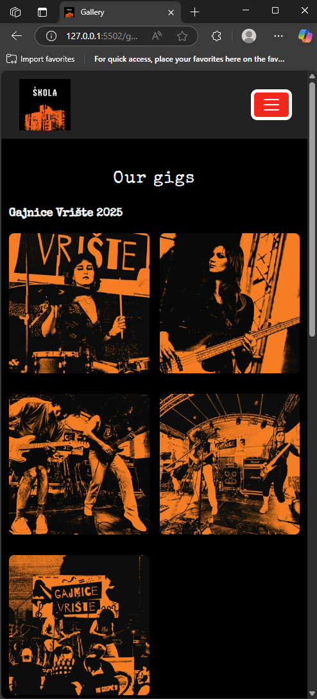

# Škola Bend Website

## Table of Contents
- [About](#about)
- [Design & Planning](#design--planning)
  - [Brand Identity](#brand-identity)
  - [Objectives](#objectives)
    - [Main Objective](#main-objective)
    - [Supporting Objectives](#supporting-objectives)
  - [User Stories, Acceptance Criteria & Test Cases](#user-stories-acceptance-criteria--test-cases)
    - [Index Page (About Page)](#index-page-about-page)
    - [Gallery Page](#gallery-page)
    - [Contact Page](#contact-page)
    - [Feedback Page](#feedback-page)
- [Wireframes](#wireframes)
- [Screenshots](#screenshots)
- [Design & Styling Details](#design--styling-details)
  - [Typography](#typography)
  - [Colour Scheme](#colour-scheme)
  - [Layout & Structure](#layout--structure)
  - [Components](#components)
  - [Contact Form](#contact-form)
  - [Accessibility](#accessibility)
  - [Responsive Design](#responsive-design)
- [Accessibility Considerations](#accessibility-considerations)
- [Features](#features)
- [Folder Structure](#folder-structure)
- [Additional Features](#additional-features)
- [Technologies Used](#technologies-used)
  - [Development Tools](#development-tools)
  - [Design & UI Tools](#design--ui-tools)
  - [Testing & Validation Tools](#testing--validation-tools)
  - [Additional Tools](#additional-tools)
- [Testing](#testing)
- [Deployment](#deployment)
- [Stretch Goals & Future Enhancements](#stretch-goals--future-enhancements)
- [Bugs & Fixes](#bugs--fixes)
- [Credits](#credits)
- [License](#license)

---

## About

This is the official website for Škola Bend, an energetic alternative rock/punk band hailing from Zagreb, Croatia. The site offers fans and event organizers an easy way to explore the band’s story, enjoy a gallery of live performances, and get in touch through a simple contact form. Designed with a modern, accessible, and fully responsive layout, the website ensures a seamless experience on any device.

The inspiration for this project came from a close friend who is part of Škola Bend, alongside family and friends—people I know well and have watched grow together through music. For the past three years, they’ve been passionately playing and honing their sound. Over the last year, they’ve taken the stage at local pubs, bars, and small festivals, even opening for well-known acts. Earlier this year, they released their debut single, “Ova Pjesma” (“This Song”), marking an exciting milestone in their journey.

As their presence in the Croatian music scene quickly grows, they needed an official online hub where fans, friends, and event organizers could easily find reliable information. Since they’re still emerging artists, the site focuses on essential content rather than extensive features like merchandise or tour dates. The goal was to create a bold, edgy punk vibe that resonates with their audience, informs newcomers about their music, and provides a direct point of contact for booking future gigs and events.

---

## Design & Planning

### Brand Identity

The design reflects Škola Bend’s edgy and dynamic personality, combining bold typography and a vibrant color palette that matches their musical style. Custom fonts and icons reinforce the band’s alternative aesthetic, while the layout prioritizes usability and accessibility.

### Objectives

#### Main Objective

To create an official website for the band that showcases their music and style, while providing an easy way for fans and event organizers to get in touch for bookings and inquiries.

#### Supporting Objectives

- Ensure the website is fully responsive and accessible across all devices and screen sizes.
- Create an intuitive navigation structure for easy browsing.
- Incorporate a visually appealing, punk-inspired design that reflects the band’s identity.
- Provide a gallery to showcase live performances and band moments.
- Implement a contact form that is simple to use and accessible to all users.
- Optimize site performance for fast loading times.
- Include social media links to increase fan engagement and online presence.
- Use semantic HTML and accessibility best practices to make the site usable by everyone, including those with disabilities.

## User Stories, Acceptance Criteria & Test Cases

### Index Page (About Page)

#### Band Member (Owner)

- **User Story:**  
  As a member of Škola Bend, I want our band’s story, lineup, and achievements to be front and center on the homepage, so visitors immediately understand who we are and what makes us unique.

- **Acceptance Criteria:**  
  - Prominent section with the band’s collective story and values is visible on page load.  
  - The full band lineup is listed by name.  
  - Achievements, milestones, and unique aspects of the band are highlighted (for now - first song release).  
  - Easy-to-find links for booking/contact and social media.

- **Test Cases:**  
  - Verify that the band’s story and lineup are present and accurate.  
  - Check that achievements and milestones are clearly displayed.  
  - Ensure booking/contact links are visible and functional.

#### Visitor

- **User Story:**  
  I want to quickly learn about Škola Bend and their music style, so I can decide if I want to explore further.

- **Acceptance Criteria:**  
  - Clear introduction of the band and music style is visible on page load.  
  - Content is concise and easy to read.  
  - Page loads quickly and looks good on desktop and mobile.

- **Test Cases:**  
  - Verify that the introduction text is present and accurate.  
  - Check page responsiveness on various screen sizes.  
  - Measure load time is under 3 seconds on a standard connection.

#### Fan

- **User Story:**  
  I want to find interesting background information about the band members to feel connected to their story.

- **Acceptance Criteria:**  
  - Biographies or short profiles of band members are included or linked.  
  - Band’s story and formation details are displayed clearly.

- **Test Cases:**  
  - Verify presence of bios or band story section.  
  - Confirm the text is readable and free of errors.

#### Event Organizer

- **User Story:**  
  I want to understand the band’s style and background to evaluate if they fit an event.

- **Acceptance Criteria:**  
  - Professional and concise band overview is provided.  
  - Contact information or clear link to contact page is available.

- **Test Cases:**  
  - Confirm band overview includes music genre and achievements.  
  - Ensure contact link/button is visible and functional.

#### Developer

- **User Story:**  
  I want the homepage code to be clean and semantic for easy maintenance and accessibility.

- **Acceptance Criteria:**  
  - Semantic HTML elements like `<header>`, `<main>`, `<section>` used properly.  
  - Accessibility features (ARIA roles, alt text) are implemented.

- **Test Cases:**  
  - Run accessibility audit (e.g., Lighthouse or axe).  
  - Inspect HTML structure for semantic correctness.

---

### Gallery Page

#### Band Member (Owner)

- **User Story:**  
  As a member of Škola Bend, I want our gallery to showcase our best live moments and performances, so fans and event organizers can see our energy and stage presence.

- **Acceptance Criteria:**  
  - Gallery features high-quality images from gigs and events.  
  - Photos highlight the band’s energy, style, and connection with the audience.  
  - Images are organized by event or theme, with clear captions or context.  
  - Easy-to-use layout for both desktop and mobile users.

- **Test Cases:**  
  - Verify that images from key performances are present and load correctly.  
  - Check that the gallery layout is responsive and accessible.  
  - Confirm that captions/context are accurate and helpful.

#### Visitor

- **User Story:**  
  I want to browse images to get a feel for the band’s live performances.

- **Acceptance Criteria:**  
  - Gallery displays images with captions or descriptions.  
  - Clicking images opens them in a larger view or lightbox.

- **Test Cases:**  
  - Check images are displayed on page load.  
  - Test image click opens lightbox/modal correctly.

#### Fan

- **User Story:**  
  I want to share gallery images on social media or save them.

- **Acceptance Criteria:**  
  - Social sharing buttons or download options available near images.  
  - Images are optimized for fast loading without quality loss.

- **Test Cases:**  
  - Verify social share buttons open correct share dialogs.  
  - Confirm image downloads work if enabled.

#### Event Organizer

- **User Story:**  
  I want to see photos that demonstrate the band’s stage presence to assess professionalism.

- **Acceptance Criteria:**  
  - Gallery contains a variety of high-quality live performance images.  
  - Images reflect the band’s energy and professionalism.

- **Test Cases:**  
  - Validate presence of diverse live photos.  
  - Confirm images load quickly and display correctly.

#### Developer

- **User Story:**  
  I want gallery images optimized and lazy-loaded for performance.

- **Acceptance Criteria:**  
  - Use `srcset` for responsive images.  
  - Lazy loading implemented to defer offscreen images.

- **Test Cases:**  
  - Inspect image elements for `srcset` attributes.  
  - Use network throttling to test lazy loading.

---

### Contact Page

#### Band Member (Owner)

- **User Story:**  
  As a member of Škola Bend, I want an easy way for fans, organizers, and collaborators to contact us, so we never miss an opportunity or message.

- **Acceptance Criteria:**  
  - Contact form is simple, accessible, and works on all devices.  
  - All messages are delivered to the band (or a designated contact).  
  - Social media and alternative contact options are visible.  
  - Confirmation/thank-you message is shown after submission.

- **Test Cases:**  
  - Submit a test message and verify receipt/confirmation.  
  - Check that all contact options are visible and functional.  
  - Confirm form works on desktop and mobile.

#### Visitor

- **User Story:**  
  I want a straightforward way to reach the band with questions or messages.

- **Acceptance Criteria:**  
  - Contact form is visible and easy to fill out.  
  - Alternative contact methods (email, social media) displayed.

- **Test Cases:**  
  - Submit form with valid data and confirm submission success.  
  - Verify alternative contact info is visible and correct.

#### Fan

- **User Story:**  
  I want reassurance that my message was received after contacting the band.

- **Acceptance Criteria:**  
  - Confirmation message or thank-you page appears after form submission.

- **Test Cases:**  
  - Submit form and verify confirmation feedback displays.

#### Event Organizer

- **User Story:**  
  I want to contact the band quickly to book a performance.

- **Acceptance Criteria:**  
- **Test Cases:**  
  - Confirm booking fields (like event date, location) exist if applicable.  
  - Test form submission includes booking info.

#### Developer
- **User Story:**  
  I want to ensure form validation and error handling work correctly.

- **Acceptance Criteria:**  
  - Form validates required fields before submission.  
  - Clear error messages appear for invalid inputs.

- **Test Cases:**  
  - Attempt to submit empty form and verify errors.  
  - Try invalid inputs (e.g., invalid email) and check error prompts.

---

### Feedback Page

#### Band Member (Owner)

- **User Story:**  
  As a member of Škola Bend, I want users to see a clear confirmation that their message was sent successfully, so they know we received their contact form submission.

- **Acceptance Criteria:**  
  - The page displays a clear confirmation or thank-you message after the contact form is submitted.  
  - There is a visible button or link to return to the contact page or main site.  
  - No feedback form or comment fields are present.

- **Test Cases:**  
  - Submit the contact form and verify the confirmation message appears.  
  - Check that the "Go Back" button or link works as intended.

#### Visitor

- **User Story:**  
  I want to know that my message to the band was sent successfully, so I feel confident my inquiry was received.

- **Acceptance Criteria:**  
  - A confirmation or thank-you message is shown after submitting the contact form.  
  - There is a clear way to return to the contact page or main site.

- **Test Cases:**  
  - Submit the contact form and verify the confirmation message appears.  
  - Click the "Go Back" button or link and confirm it works.

#### Developer

- **User Story:**  
  I want the feedback confirmation page to be simple, accessible, and free of unnecessary forms or fields.

- **Acceptance Criteria:**  
  - Page contains only a confirmation message and navigation option.  
  - No feedback/comment form is present.  
  - Page is accessible and works on all devices.

- **Test Cases:**  
  - Inspect the page to confirm only confirmation content is present.  
  - Test accessibility and navigation on desktop and mobile.

---

## Wireframes

Below are the Balsamiq wireframes for both desktop and mobile versions of each page. These wireframes were created during the planning phase to visualize the layout, navigation, and user flow before development began. Each wireframe demonstrates the intended structure and accessibility considerations for both large and small screens.

### Home (About Us)

**Desktop Version:**


- Features a bold hero section introducing the band.
- Includes navigation bar, main content area with band story, and footer with social links.
- Layout emphasizes readability and visual hierarchy.

**Mobile Version:**


- Stacked layout for easy scrolling.
- Mobile navigation (hamburger menu) and simplified content blocks.

### Gallery

**Desktop Version:**


- Grid layout for image thumbnails.
- Clickable images open larger views.
- Navigation and footer consistent with other pages.

**Mobile Version:**


- Single-column image list for easy thumb navigation.
- Responsive images and touch-friendly design.

### Contact

**Desktop Version:**


- Prominent contact form with labeled fields.
- Alternative contact info (email, social links) visible.
- Clear call-to-action button.

**Mobile Version:**


- Form fields stacked vertically for mobile usability.
- Large, accessible buttons and input areas.

### Feedback

**Desktop Version:**


- Simple feedback form with message area and submit button.
- Confirmation message area for user feedback.

**Mobile Version:**


- Streamlined form for quick feedback submission on mobile devices.
- All elements sized for touch interaction.

---

## Screenshots

Below are screenshots of the real, finished site on both desktop and mobile devices for each main page. These images demonstrate the final implementation, responsive design, and visual consistency across different screen sizes.

### Home (About Us)

**Desktop – Navbar:**


**Desktop – Footer:**


**Mobile:**


**Mobile – Dropdown Menu:**


### Gallery

**Desktop – Navbar:**


**Desktop – Footer:**


**Mobile – Footer:**


**Mobile – Hovered Navbar:**



### Contact

**Desktop:**


**Mobile:**


### Feedback

**Desktop:**


**Mobile:**


---

## Design & Styling Details

### Typography

- The site uses the **SpecialElite** font as the primary typeface, imported via a custom `@font-face` rule from a local `.woff` font file.  
  This vintage typewriter-style font reflects the band’s alternative, punk-inspired aesthetic.
- For body text, the font stack falls back to a clean sans-serif font for readability and accessibility.
- Headings (`h2`) use SpecialElite with letter spacing (`2px`) to emphasize the edgy, handcrafted feel.
- Paragraphs are set with a comfortable font size (`1.1rem`) and line height (`1.6`) for easy reading.

### Colour Scheme

- The overall background is **black (#000)** to create a dark, moody atmosphere fitting for an alternative rock band.
- Text is primarily **white (#fff)** for high contrast and legibility.
- Links and interactive elements use a bold **red (#ff0000)** accent color to convey passion and energy.
- On hover/focus states, link colors invert to white with underlines to improve user feedback.
- The navbar and footer backgrounds are a **dark charcoal (#222)** for subtle contrast with the page background while maintaining the dark theme.

### Layout & Structure

- The site layout uses flexible containers (`.container`, `.container-fluid`) with responsive widths and padding to center content on all screen sizes.
- The body is a flex column with `min-height: 100vh` to enable a sticky footer that stays at the bottom on short pages.
- Text is often centered for emphasis on the homepage/about section and contact form.

### Components

- **Navbar:**  
  - Background is charcoal black with white text in SpecialElite font.  
  - Active navigation links are highlighted in red with underline.  
  - Hamburger toggle icon is custom white for visibility on dark background.
- **Footer:**  
  - Dark background matching navbar with white text and right-aligned content on desktop, centered on mobile.  
  - Social media icons are white with red hover/focus states and visible outlines for accessibility.
- **Buttons:**  
  - Bold red backgrounds with white text, rounded corners, and letter spacing for a punk vibe.  
  - On hover, buttons darken to a deeper red for interaction feedback.

### Contact Form

- The contact section features a striking black and red gradient background with subtle box shadows for depth.
- Input fields have dark backgrounds with white text and red focus outlines.
- Submit buttons are styled consistently with other buttons but also have a bold border and shadow for prominence.
- The contact form background uses a repeating diagonal red stripe pattern over black with subtle white noise overlays for a gritty punk texture.

### Accessibility

- Focus-visible outlines are custom red or white, highly visible for keyboard users.
- Reduced motion media query disables transitions and animations for users who prefer minimal movement.

---

*This design system supports the band’s edgy, punk-inspired identity while ensuring accessibility, usability, and responsive performance across devices.*

## Accessibility Considerations

- Use semantic HTML elements such as `<nav>`, `<main>`, `<footer>`, etc., to provide meaningful page structure.
- Include ARIA roles and labels (e.g., `aria-label`, `aria-labelledby`, `aria-expanded`, `aria-controls`) to improve screen reader support.
- Ensure high contrast color schemes and visible focus outlines for better visibility and keyboard navigation.
- Use accessible form labels paired with inputs and visible placeholders where appropriate.
- Implement a “Skip to main content” link for keyboard users to bypass repetitive navigation.
- Use screen-reader-only text with a `.visually-hidden` class to provide additional context without cluttering the visual interface.
- Ensure interactive elements like buttons and links have descriptive labels and states.
- Use responsive and accessible embedded media with meaningful `title` attributes on iframes or videos.
- Provide accessible social media links with proper `aria-label`s and visually hidden text for screen readers.

## Features

- Responsive design using Bootstrap 5
- Semantic HTML5 structure for accessibility
- Sticky footer on all pages
- Image gallery with uniform aspect ratio and high-DPI support (WebP images)
- Contact form with visible placeholders and accessible labels
- Social media links with accessible Font Awesome icons
- Consistent navigation and footer across all pages
- Visually hidden text for screen readers

## Folder Structure

```
assets/
  css/
    styles.css
  fonts/
    SpecialElite-Regular.woff
  images/
    favicon.ico
    skolalogo.png
    gajnice/
      large/
        all.webp
        eva-playing-drums.webp
        everybody-except-eva.webp
        iva-playing-bass-guitar.webp
        max-davor-iva.webp
      thumbnail/
        all.webp
        eva-playing-drums.webp
        everybody-except-eva.webp
        iva-playing-bass-guitar.webp
        max-davor-iva.webp
    ksff/
      large/
        davor-and-antun.webp
        eva.webp
        fico.webp
        ivamakseva.webp
        jura.webp
        krv.webp
        maksivaroko.webp
        whole-band.webp
      thumbnail/
        davor-and-antun.webp
        eva.webp
        fico.webp
        ivamakseva.webp
        jura.webp
        krv.webp
        maksivaroko.webp
        whole-band.webp
    pages/
      about-us-desktop-footer.png
      about-us-desktop-navbar.png
      about-us-mobile-dropdown.png
      about-us-mobile.png
      contact-desktop.png
      contact-mobile.png
      feedback-desktop.png
      feedback-mobile.png
      gallery-desktop-footer.png
      gallery-desktop-navbar.png
      gallery-mobile-footer.png
      gallery-mobile-hovered-over-navbar.png
    wireframes/
      about-us-desktop.png
      about-us-mobile.png
      contact-desktop.png
      contact-mobile.png
      feedback-desktop.png
      feedback-mobile.png
      gallery-desktop.png
      gallery-mobile.png
contact.html
gallery.html
index.html
feedback.html
README.md

```

## Additional Features

- Keyboard-accessible navigation through Bootstrap ensuring usability for all users.
- Optimized images to enhance load times and overall performance.
- SEO-friendly meta tags to improve search engine visibility.
- Contact form with built-in validation and clear error handling for better user feedback.

## Technologies Used

- HTML5 (semantic markup)
- CSS3 (custom styles)
- [Bootstrap 5.3.3](https://getbootstrap.com/) (CSS framework for layout, grid, and components)
- [Font Awesome 6](https://fontawesome.com/) (icon library for social icons)
- WebP images for gallery and band photos
- [Google Fonts: Special Elite](https://fonts.google.com/specimen/Special+Elite) (band branding font, self-hosted)
- No custom JavaScript (all interactivity handled by Bootstrap's JS via CDN)

---

### Development Tools

- **Visual Studio Code:** Primary code editor, with extensions to boost productivity and streamline development workflows.
- **Git & GitHub:** Version control and collaborative platform to manage codebase and track changes.
- **Live Server (VS Code extension):** Provided instant preview and live reload during development for faster iteration.
- **Git Bash / Terminal:** Command-line interface used for running Git commands and managing project files efficiently.

### Design & UI Tools

- **Balsamiq Wireframes:** Employed for early-stage planning and visualizing website layout and user flow through low-fidelity mockups.
- **Google Fonts:** Integrated custom, web-optimized fonts to improve typography aesthetics and readability.
- **Font Awesome:** Added scalable vector icons to enrich UI elements such as social media buttons, ensuring visual consistency.
- **Favicon Generator:** Created and implemented a custom favicon to enhance brand identity and browser tab visibility.

### Testing & Validation Tools

- **W3C Markup Validator:** Verified HTML markup compliance with web standards to ensure cross-browser compatibility and accessibility.
- **W3C CSS Validator:** Checked CSS code quality, adherence to standards, and detected potential styling issues early.

### Additional Tools

- **ChatGPT:** Assisted with code suggestions, content refinement, and accessibility improvements.
- **Grammarly:** Proofread and enhanced written content for clarity, grammar, and tone.
- **RedKetchup.io:** Optimized and compressed images to improve load times without sacrificing quality.
- **TinyPNG:** Compress PNG and JPEG images with minimal quality loss.
- **Cloudinary PNG to WebP Converter:** Convert PNG images to webp format for better performance.
- **Red Ketchup Image Resizer:** Resize and compress images efficiently.
- **FreeConvert PNG to WebP:** Quick online conversion tool for PNG to webp.
- **ImageResizer:** Download and resize images with ease.

---

## Testing

Comprehensive testing was performed to ensure a seamless user experience across different environments:

- **Cross-Browser Testing:** Verified consistent functionality and appearance in major browsers such as Chrome, Firefox, Safari, and Edge.
- **Responsive Testing:** Ensured the website adapts fluidly to various screen sizes and device types, maintaining usability on mobiles, tablets, and desktops.
- **Accessibility Audits:** Conducted checks using screen readers and accessibility tools to confirm compliance with WCAG guidelines, including keyboard navigation and ARIA attributes.
- **Form Validation:** Implemented both client-side and server-side validation for contact forms to provide immediate feedback and prevent erroneous submissions.

---

## Deployment

### Setting up the Repository

- Use the Code Institute template to create your GitHub repo.
- Clone the repo locally using VS Code or the command line.

### Manual Deployment (Command Line)

```bash
git init
git add .
git commit -m "Initial commit"
git remote add origin https://github.com/YOUR-USERNAME/YOUR-REPO.git
git push -u origin main
```

## Publishing with GitHub Pages

1. Go to your GitHub repository **Settings**.
2. Select **Pages** from the sidebar.
3. Choose the branch you want to deploy (typically `main`).
4. Click **Save** and wait for the live URL to be generated.

---

## Stretch Goals & Future Enhancements

- **Audio Player Integration:** Embed an audio player to allow visitors to listen to the band’s songs directly on the site, enhancing user engagement.
- **Blog / News Section:** Add a dedicated area for news, announcements, and band updates to keep fans informed about recent activities and releases.
- **Event Calendar:** Implement a dynamic calendar showcasing upcoming shows, tours, and events, with links for ticket purchases or RSVPs to improve fan experience and increase attendance.
- **Merchandise Store:** Develop an online shop to sell band merchandise such as t-shirts, posters, vinyl, and other memorabilia, providing an additional revenue stream and fan engagement.
- **Multilingual Support:** Introduce language options (Croatian and English) to cater to a broader audience and international fans.
- **Enhanced Contact Form:** Upgrade the current contact form (currently a mockup) to a fully functional form that can send messages directly to the band’s email. This could include features like file uploads for fan submissions or press inquiries.
- **Social Media Integration:** Add live social media feeds or embed posts to showcase the band’s latest interactions and promote fan community engagement.
- **Newsletter Signup:** Implement a subscription feature to collect fan emails and send updates, exclusive content, or event reminders.
- **Accessibility Improvements:** Continue refining accessibility features to ensure an inclusive experience for all users, including keyboard navigation, screen reader support, and adjustable contrast settings.

---

**Note:** The current contact form on the site is a static mockup; submitting messages does not trigger any email or backend process. It can be connected to an actual email service or backend form handler if required for real message delivery.

---

## Bugs & Fixes

- **Font Choice & Special Characters:**
  Initially, I used the FrederickSans font from dafont.com because it matched the band’s logo style. However, this font was very slim and all uppercase, making text hard to read. More importantly, it didn’t support special characters properly — for example, the band’s name includes the character &Scaron;, which displayed correctly in their logo but not on the website using this font. To fix this, I switched to a punk/edgy Google Font that fully supports special characters, offers better readability, and fits the band’s rock aesthetic.
- **FontAwesome Icon Display Issue:**
  When adding FontAwesome icons to the social media links in the footer, the entire socials section failed to display. Despite careful review and consulting multiple resources, the root cause was unclear. As a temporary solution, I used PNG images of the icons, but resizing those caused image distortion and crashes. After further adjustments to the code and styles, I successfully reintroduced the FontAwesome icons, which resolved the issue.
- **Gallery Image Sizes and Quality:**
  Some gallery images had inconsistent heights, causing a visually uneven layout. Attempts to resize them uniformly led to pixelation and quality loss. After consulting with a mentor, I implemented thumbnail images linked to full-size versions, optimized and compressed using WebP format to maintain quality while improving load times and compatibility across browsers.
- **Contact Form Functionality:**
  The contact page originally included a Formspree integration to send messages to an email address. However, submitting the form redirected users away from the site to the Formspree feedback page, which disrupted the user experience. Opening the form in a new tab caused the “Go Back” button on the Formspree page to malfunction because there was no browsing history in the new tab. To address this, I replaced the form with a mockup version that does not send data externally but navigates users to a custom feedback page within the site. This mockup is for demonstration purposes; the form can be connected to an email service if the band chooses to use the site live.

---

## Credits

### Code & Text Content

- Sara Jelic — Development, content writing, and design.
- ChatGPT — Assistance with writing.

### Media

- Škola Bend — Band photos and logos.
- Event photographers — Live performance images.

### Acknowledgments

- Thanks to the band members for their inspiration and feedback.
- Open-source communities behind Bootstrap, Font Awesome, and Google Fonts.

## License

<!-- State the license type and link to the LICENSE file. -->
This project is licensed under the MIT License. See the [LICENSE](LICENSE) file for details.
