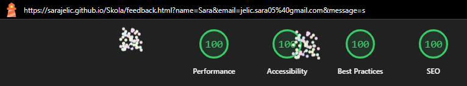
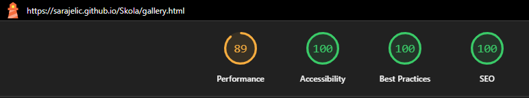

# Testing & Validation

## Table of Contents
- [During Development Testing](#during-development-testing)
- [Manual Testing](#manual-testing)
- [Bugs and Fixes](#bugs-and-fixes)
- [Post Development Testing](#post-development-testing)
  - [Validators](#validators)
    - [HTML](#html)
    - [CSS](#css)
  - [Lighthouse Scores](#lighthouse-scores)
    - [Desktop Version](#desktop-version)
    - [Mobile Version](#mobile-version)
  - [Accessibility](#accessibility)

## During Development Testing

All major errors and warnings encountered during development were documented and addressed as they arose. For details on fixes and design decisions, see the README.

- Issues with cache policy, third-party scripts, and webfont loading were identified and resolved or documented if unfixable (see below).
- Accessibility, navigation, and contrast issues were fixed iteratively.
- Image optimization and layout stability were improved throughout development.

## Manual Testing

- **Accessibility Testing:** Confirmed compatibility with screen readers and keyboard navigation.
- **Cross-Browser Testing:** Site tested across all major browsers (Chrome, Firefox, Edge, Safari).
- **Responsive Testing:** Verified on mobile, tablet, and desktop screen sizes.
- **User Experience:** All navigation, forms, and interactive elements are accessible and usable via keyboard.

## Bugs and Fixes

- **Font Choice & Special Characters:**
  Switched from `FrederickSans` to `SpecialElite` due to readability issues and lack of support for characters like “Š”.
- **FontAwesome Icon Display Issue:**
  Resolved issue with missing social media icons; initially used PNG placeholders, later replaced with FontAwesome via code adjustments.
- **Gallery Image Consistency:**
  Fixed inconsistent image heights by using uniform thumbnails and full-size WebP images for better layout and load times.
- **Contact Form User Experience:**
  Replaced external Formspree with custom feedback page for seamless UX; current version functions as a demo.
- **Redundant nav link vs. crawlability (WAVE vs. Lighthouse SEO):**
  Kept `href` on all nav links for SEO and accessibility, accepting the WAVE redundant link warning as informational.
- **Contrast, navigation, and accessibility issues:**
  Improved color contrast, updated navbars for correct active/current logic, fixed heading levels, and added ARIA labels.
- **Unoptimized images and LCP (Largest Contentful Paint):**
  Compressed and resized images, added explicit width/height and preload for the logo, and used WebP format for gallery images. Note: Lighthouse may still issue performance warnings related to image sizes or LCP, even after optimization. All images have been adapted and optimized to minimize these warnings as much as possible, but some automated tools may flag issues due to their strict thresholds or simulated network conditions.
- **Unused CSS/JS:**
  Removed all unused CSS and JavaScript. The only custom JavaScript in use is for lazy-loading the YouTube video on the homepage (see index.html). Bootstrap JS is loaded via CDN only as needed.
- **Form autofill font fallback:**
  Added robust autofill CSS to ensure custom font is used after selection. Note: When browser autofill options are displayed (e.g., when hovering over Chrome's autofill dropdown), the font may temporarily revert to the browser default. Once an option is selected, the custom font is correctly applied. This is a browser-level behavior and cannot be fully overridden with CSS.
- **Redundant/empty elements (e.g., figcaption, visually hidden spans):**
  Removed unnecessary elements, kept only descriptive alt text and ARIA labels.
- **Image elements do not have explicit width and height (CLS):**
  Explicit `width` and `height` attributes were added to all key images, including the logo and gallery images, in the HTML files.
- **Other Issues:**
  See the detailed list of warnings and fixes in the sections below.

## Post Development Testing

### Validators

#### HTML
- **W3C Markup Validator:** HTML verified for compliance.
- **Common Warnings:**
  - Use of `<h1>` as a top-level heading only (informational, correct usage).
  - Section or article lacks heading, or heading order warning: The site uses a single `<h1>` per page, with all other headings (`<h2>`–`<h6>`) in correct descending order. Some headings are placed within `<article>` or other semantic elements to improve code structure and clarity for developers. While this enhances semantic organization and maintainability, automated validators may still issue warnings. These do not impact accessibility or user experience and are considered best practice for modern HTML.
  - Possible misuse of `aria-label` (resolved): All `aria-label` attributes are now used only where necessary for accessibility, such as on navigation or social media links, and have been removed from elements where they were redundant or confusing.
  - Button inside element with `role=button` (resolved): All interactive elements now use the correct native HTML elements (e.g., button tag for buttons), and no button tag is placed inside an element with `role=button`. Markup was refactored to ensure semantic correctness and accessibility.

#### CSS
- **W3C CSS Validator:** CSS checked and passed.

### Lighthouse Scores

#### Desktop Version
- All desktop pages scored 100 in all categories after optimization.
- Accessibility warnings addressed (color contrast, heading order, ARIA attributes, alt text, focus states).
- Performance improved by optimizing images (WebP), lazy-loading non-critical assets, and preloading LCP images.
- Best Practices and SEO warnings resolved (meta descriptions, link `href`/`aria-current`, favicon, etc.): All pages now include unique and descriptive meta descriptions, a favicon, and correct use of `href` and `aria-current` attributes on navigation links. External CSS and icon libraries are loaded non-blocking for performance. All links are crawlable for SEO, and redundant or missing attributes have been addressed to meet best practices.
- <strong>Note:</strong> If you see a "Serve static assets with an efficient cache policy" warning in Lighthouse, this is due to GitHub Pages' default cache settings (10 minutes TTL). This cannot be changed from the codebase. All images and assets are optimized for size and performance, and this warning does not impact real-world user experience.
- Remaining warnings (if any) are due to third-party scripts (YouTube) or hosting limitations (GitHub Pages cache policy) and are documented below.

##### Index Page
- 

##### Gallery Page
- 

##### Contact Page
- 

##### Feedback Page
- 

#### Mobile Version
- Mobile scores are similar to desktop, with minor differences due to device emulation and network throttling in Lighthouse.
- All mobile pages scored 100 in Accessibility, Best Practices and SEO after optimization.
- Performance in index page and gallery page scored 89, see Note below for explanation.
- All actionable issues were fixed; remaining warnings are due to third-party scripts or hosting limitations.

##### Index Page
- 

##### Gallery Page
- 

##### Contact Page
- 

##### Feedback Page
- 

### Accessibility
- All navigation, forms, and interactive elements are accessible and usable via keyboard.
- ARIA attributes and semantic HTML are used throughout.
- Color contrast and focus indicators meet accessibility standards.
- See README for a summary of accessibility features and any known limitations.

---

All actionable performance, accessibility, and best-practice issues in your code have been addressed and fixed. The only remaining warnings are caused by third-party services (YouTube) or hosting limitations (GitHub Pages cache policy) and cannot be fixed from your codebase. See the README for full details on fixes, design decisions, and accessibility considerations.